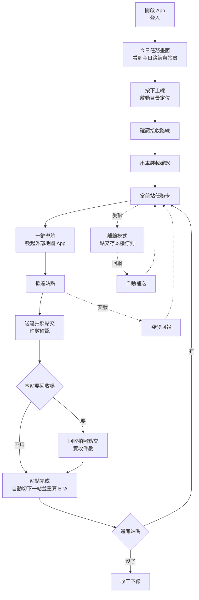
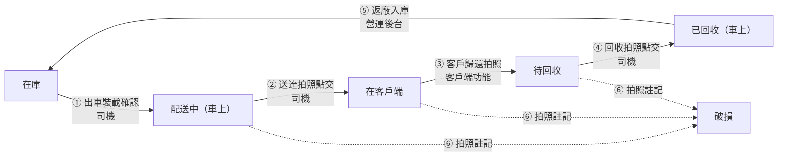

# 配送司機 App - 產品需求文件

> **這是為了 UI/UX 設計協作而整理的公開版本。**
> 已移除客戶識別資訊、合約條款與金額、基礎設施位址與真實營運數據；
> 設計工作需要的部分（流程、畫面、狀態、互動、設計語彙）完整保留。
> 文件中出現的機構名稱、人名、地址、數字皆為示意用的假資料。

---

## 1. 這是什麼產品

一支給**餐點配送司機**用的 Android App。它跟一般的物流司機 App 有一個關鍵差異：

**送餐的同時要把上一批餐具收回來。** 餐具是陶瓷的、可重複使用，所以每一站不是「送達就結束」，
而是「送 X 個、收 Y 個」。而且這批餐具在系統裡必須全程知道它在哪裡、還有多少 -
**司機的拍照點交，就是這本帳唯一的資料來源**，沒有第二個地方可以輸入。

這件事決定了整支 App 的形狀：它不是一個功能選單，而是一條**會自己往前推的輸送帶**。

### 使用者

單一角色：司機。沒有其他角色會用到這支 App。

### 使用情境（設計時請一直記著這個畫面）

- 人在車上，或剛下車站在騎樓
- **單手操作**，另一手可能提著餐箱
- 可能戴著手套
- **太陽直射螢幕**
- 車外有人在等
- 地下停車場、大樓死角**沒有訊號**
- 一天要重複這個動作幾十次

---

## 2. 設計原則

這五條是從上面那個使用情境倒推的，不是設計偏好。

### 一、一個畫面，一件事

當前任務卡佔滿首屏，其餘站點縮成清單。司機任何時候低頭看一眼，
都不需要判斷「現在該做什麼」。

### 二、拇指區優先

所有主要動作固定在畫面下半部，觸控目標 ≥48dp。
上半部只放資訊，不放會誤觸的按鈕。

### 三、離線是預設，不是例外

不做「離線警告彈窗」。連線狀態只是頂部一條細橫幅，
點交照常做、照常給完成回饋，同步在背景自己處理。

### 四、相機是主要輸入

點交畫面一進去就是取景器，不是「請按此拍照」的按鈕。
照片是點交的必要條件，不是附件。

### 五、看不到的，就不放進來

畫面上出現的每一個欄位，都必須是完成這一站真正需要的。
司機端不存在任何客戶資料查詢入口。

---

## 3. 設計語彙

### 色票

品牌色為藕紫。**標誌原色本身對比度不足以承載文字**（白字僅 2.47:1），
因此按鈕與徽章一律使用同色相往下取明度的深階，並實際計算對比度到 WCAG AA 以上。
**請照抄，不要目視微調。**

| Token | 值 | 用途 | 對比度 |
|---|---|---|---|
| `background` | `#e9e3d7` | 頁面外底色 | - |
| `surface` | `#faf5ec` | 內容區底色 | 對 foreground 約 13:1 |
| `card` | `#fffdf9` | 卡片底色 | - |
| `foreground` | `#2a2724` | 主要文字 | - |
| `brand` | `#bb97b8` | 標誌原色。**僅裝飾用**（分隔線、圖示襯底），不可承載文字 | 白字 2.47:1 ✗ |
| `primary` | `#7c5079` | 主要動作按鈕 | 白字 6.19:1 ✓ |
| `primary-deep` | `#5c3859` | 按下態、強調 | 白字 9.38:1 ✓ |
| `secondary` | `#f6eef6` | 次要底色、選取態 | - |
| `muted` | `#f3ede1` | 中性區塊底 | - |
| `muted-foreground` | `#636058` | 次要文字 | - |
| `destructive` | `#c2503f` | 危險與警示 | - |
| `success` | `#3f7a5e` | 完成狀態 | - |
| `warning` | `#a8701f` | 需注意狀態 | - |
| `border` | `#e7e1d6` | 分隔線、外框 | - |

圓角基準 `12px`（卡片）／`10-11px`（按鈕）。

### 為什麼是亮色而不是深色

直覺上「司機 App 應該用深色」，但實際情境相反：手機在**陽光下**，
亮底深字的可讀性最高（螢幕最大亮度在白底時最有效）。

這套配色與同系統的網頁端共用，差別**在尺寸不在顏色**：
司機端的字級與觸控目標整體放大一階。

### 字級與觸控

| 用途 | 建議 |
|---|---|
| 站點名稱（當前任務卡） | 18-20sp，襯線體，粗 |
| 主要按鈕文字 | 15-16sp，粗 |
| 資訊列（地址、時段） | 12.5-13sp |
| 標籤徽章 | 10.5-11sp，粗 |
| 數字（件數、ETA） | 等寬數字，21sp 以上 |
| 觸控目標 | **最小 48dp**，加減鍵不小於 34dp 且間距足夠 |

正體中文 UI。**中文句子之間不留空白。**

---

## 4. 資訊架構

底部四分頁，永遠可見：

| 分頁 | 內容 |
|---|---|
| **任務** | 主畫面。當前站 ＋ 後續站點清單 |
| **地圖** | 今日路線總覽（唯讀） |
| **回報** | 突發狀況回報 |
| **我** | 個人資料、上下線、設定 |

九成的時間司機都停在「任務」分頁。其他三個是需要時才去。

---

## 5. 核心流程

主幹是一條**單行道**：上線 → 裝載 → 一站接一站 → 下線。
中間沒有分支、沒有選單、沒有「要先做哪個」。
唯二的岔路（突發回報、離線）都是被動觸發，司機不會主動去找它們。

---

## 6. 畫面規格

以下 12 個畫面是本期範圍的全部。每一頁列出：**目的 / 內容 / 互動 / 邊界情況**。

### 6.1 登入

**目的**　讓已建帳號的司機進入 App。

**內容**　品牌標誌、產品名、一顆社群帳號登入鍵、一段說明。

**互動**　按鈕喚起第三方授權流程，回來就進主畫面。

**邊界情況**　帳號由公司預先建立並綁定，**沒有註冊、沒有忘記密碼、沒有帳號輸入欄**。
登不進去時最重要的事是**把原因講清楚**（未綁定／已停用／請聯絡營運人員），
因為司機看到錯誤只會想打電話問人。

---

### 6.2 今日任務（尚未上線）

**目的**　讓司機看到今天要跑什麼，並主動開始工作。

**內容**
- 問候與日期
- 今日路線摘要卡：路線代號、區域、波次、**站數／要送總數／要收總數**
- 「開始上線」主要按鈕
- 「確認接收路線」次要卡片
- 預計出車與收工時間、其中幾站是「完餐站」

**互動**　上線是**司機主動的動作**，不可在登入時自動啟動。
「確認接收路線」是另一個獨立動作。

**邊界情況**　按下上線才開始蒐集位置。這是司機對「我正在被定位」的知情同意，
設計上要讓這件事顯而易見，不能藏起來。

---

### 6.3 出車裝載確認

**目的**　確認車上實際裝了多少容器，並讓整趟訂單進入「配送中」。

**內容**
- **後果警語橫幅**：確認後本趟所有配送單將轉為「配送中」，屆時無法線上取消
- 各容器種類的件數確認列（預設帶出系統值，可加減調整）
- 「確認裝載並出車」主要按鈕
- 一行說明：數量與系統值不同也沒關係，以司機點的為準

**互動**　整趟只按一次。

**邊界情況**　**這是全 App 後果最大的一顆按鈕。**
它同時翻動整車的容器狀態與整趟訂單狀態，而且不可逆。
因此設計成「清單確認 ＋ 後果明示」，**不可以長得像一顆普通的「開始」鍵**。

---

### 6.4 今日任務（主畫面）

**目的**　整支 App 的家。司機九成時間停在這裡。

**內容**
- 頂部：已完成 N / 總數、上線狀態指示
- **當前任務卡（佔滿首屏）**：
  - 站序「第 N 站 / 共 M 站」
  - 回收優先級徽章（見下）
  - 站點名稱（襯線體、大）
  - 地址、時段、**預計抵達時間**
  - 「要送 X / 要收 Y」數字區塊
  - 完餐站時多一條提醒橫幅
  - 「一鍵導航」次要鍵 ＋「開始點交」主要鍵
- 後續站點：壓縮成小卡清單，只有站序、徽章、站名、時間、送收數

**互動**　完成一站後**自動切下一站並重算預計抵達時間**。
司機不需要按「回到清單」再自己找下一站 - 這是輸送帶的核心動作。

**邊界情況**
- 站數與件數**天天不同**，畫面上不可有任何寫死的數量假設
- 清單可能很長，需支援虛擬捲動
- 營運端調整站序後，清單與當前卡需在短時間內自動刷新

**回收優先級徽章**　來源資料用符號標記，但**符號在手機小字級下極難分辨**，
因此改用有顏色的文字徽章：

| 徽章 | 顏色 | 意義 |
|---|---|---|
| 新開餐 | `success` 綠 | 這站是新開始的，沒有東西要收 |
| 完餐 | `warning` 橘 | **容器必須本次或隔日收回**，漏收代價高 |
| 一般 | `muted` 灰 | 常規站 |

---

### 6.5 路線總覽地圖

**目的**　回答「我今天要跑哪些地方、跑到哪了」。**唯讀。**

**內容**
- 地圖，站點圖釘標上站序
- 圖釘依狀態著色：已完成綠、當前站紫（加光暈放大）、未抵達灰、待處理橘
- **即時自車位置**（藍點，白框）
- 底部圖例
- 下方：目前選取站點的小卡 ＋「站點詳情」「一鍵導航」

**互動**　點圖釘切換選取站點。真正要導航時**外送到系統地圖 App**。

**邊界情況**
- **不做 App 內逐步導航**。那是另一個產品的量，且做不贏成熟的地圖 App，
  司機本來也習慣用它
- 離線時圖磚載不出來，**退回成純清單**，不可整頁空白

---

### 6.6 站點詳情

**目的**　提供完成這一站所需的全部資訊，一項不多。

**內容**
- 站點名稱、地址、時段、預計抵達
- 「撥打電話」「導航」兩顆次要鍵
- 配送備註（例：大門右側電鈴按 3 樓，請交由櫃檯人員簽收）
- **收餐人名單卡：預設收合**，顯示「本站收餐人 N 位」與一顆「展開名單」鍵
- 「本站要送／要收」數字區塊
- 「開始送達點交」主要鍵、「稍後再訪」次要鍵

**互動**　名單只有在司機**主動展開**時才顯示。

**邊界情況**（這頁是受管制的資訊出口，以下是硬性設計約束）
- **沒有搜尋、沒有列表瀏覽、不能翻歷史或別人的站**
- 只有本人、當日、已指派且未結案的站點才有聯絡資訊
- 站點結案後，聯絡資訊區塊**直接消失**
- 電話**只給一支**，不做號碼清單、不做通訊錄
- 名單收合的用意是「展開才算揭露」- 沒展開的站點不留下揭露紀錄

---

### 6.7 送達拍照點交

**目的**　用照片與件數完成送達。

**內容**
- **取景器佔畫面上半**，中間提示文字，底部圓形快門
- 取景器左下**即時戳記浮層**：日期時間、站序與站名、GPS 座標與精度
- 各容器種類的件數列：標籤 ＋ 小字「任務綁定 N」＋ 加減鍵 ＋ 大數字
- 一行提示：數字可直接點按輸入
- 「確認送達」主要鍵（**未拍照時停用**）
- 停用原因文字：尚未拍照，拍完才能確認

**互動**
- 件數預設帶出任務綁定值，加減鍵處理常見的 1-2 件微調
- **數字本身可點**，跳數字鍵盤直接輸入 - 單站三十份以上的站確實存在，
  只有加減鍵會讓司機按到手痠

**邊界情況**
- **無有效照片不得確認**，且停用要**說明原因**，不能只是變灰
- 照片必須帶時間、站點、GPS 戳記
- 沒有掃碼步驟，全程不需要掃任何條碼

---

### 6.8 回收拍照點交

**目的**　收回容器並登記實收數。

**內容**
- 頂部綠色橫幅：送達已完成 N 件，接著回收
- 取景器（較矮，已拍過的顯示張數）
- 件數列：標籤 ＋「登記待回收 N」＋ 加減鍵
- **差額說明橫幅**（中性藍紫，不是紅色）
- 「拍照註記破損」次要動作
- 「確認回收並完成本站」主要鍵

**邊界情況（三條容易做錯的）**
1. **差額不是錯誤。** 登記 9 套、實收 8 套時，差的 1 套維持「在客戶端」，
   下次再收即可。用**平靜的中性提示**說明，**不可做成紅色錯誤警示** -
   這在真實作業裡每天都會發生，不是司機做錯事。
2. **客戶沒先歸還也要收得成。** 不可因為「客戶還沒操作」就擋住回收按鈕。
3. 破損是獨立的註記路徑，不佔用件數欄位。

---

### 6.9 完成回饋

**目的**　快速確認完成，並把司機推向下一站。

**內容**
- 大綠勾圓環、「第 N 站完成」、送達與回收件數
- 同步狀態說明卡：資料已存本機，同步中，不需要等待
- **下一站卡**：站序、站名、地址、**已重算的預計抵達時間**、「前往下一站」鍵

**互動**　按下確認即**本機落帳並立刻顯示完成**，
照片上傳與伺服器入帳在背景進行，頂部掛「待同步 N 筆」。

**邊界情況**　這個樂觀 UI 之所以安全，是因為伺服器端以唯一識別碼去重 -
同一筆點交重試多次上傳只會入帳一筆，所以前端可以放心重送。

---

### 6.10 突發回報

**目的**　讓司機用最少步驟回報現場狀況。

**內容**
- 一行說明：發生什麼事？選一個就送出，其他之後再補
- **四顆大選項卡**，每張含標題與一行後果說明：

| 類型 | 說明 |
|---|---|
| 遇到塞車 | 會自動重算後續站點時間，並通知等待的客戶 |
| 客戶不在 | 本站標記待處理，你可以先跑下一站 |
| 車輛狀況 | 拋錨、故障、事故 |
| 其他 | 可補充文字說明 |

- 「送出回報」主要鍵
- 底部提示：送出後 30 秒內可以撤回，按錯不用緊張

**互動**　**三步內完成**：開回報 → 選類型 → 送出。
程度與補充說明全部選填，**不擋送出**。

**邊界情況**
- 送出後需有明顯的**撤回時間窗**，這條做得夠明顯司機才敢用回報功能
- 「客戶不在」是唯一一個**不完成站點也能往前走**的路徑
- 離線時可暫存，回網自動送出

---

### 6.11 離線作業

**目的**　讓沒訊號變成一件不需要處理的事。

**內容**
- 頂部**橘色橫幅**：目前無網路連線，照常點交即可，資料存在手機裡，回到收訊範圍會自動送出
- 頂部狀態指示改為「離線 · 待同步 N」
- 當前任務卡與清單**照常可用**
- 已完成但未同步的站點：灰色「待同步」徽章
- **被改派的站點：橘色「待營運確認」徽章**，並附一行說明

**邊界情況（最容易漏、也最該做好的一條）**

離線期間該任務可能已被營運端取消或改派。回網補送時伺服器會標記
「待營運確認」且不直接入帳。這時畫面要把那一站**從綠色完成改成橘色待確認**，
並明白告訴司機：

> 這站在你離線期間被營運端改派，你的點交已送出，營運端會再確認 - **不是你做錯**。

沒有這句話，司機會以為自己白做了一站。

---

### 6.12 定位授權降級提示

**目的**　權限被降級時，用司機看得懂的話說明後果與怎麼修。

**內容**
- 橘色橫幅：目前權限是「僅使用 App 時允許」，切到其他畫面時會停止回報
- **「會有什麼影響」卡**（用司機在意的事說，不要用技術語言）：
  - 營運看板只會看到你最後一次回報的位置
  - 等待的客戶看不到正確的預計送達時間
  - 你的工作時段紀錄會出現空白
- **「需要改成」卡**：位置權限「一律允許」、開啟「使用精確位置」
- 「前往系統設定」主要鍵、「稍後再說」次要鍵
- 底部：最後回報位置與時間

**邊界情況**　Android 各廠牌的權限設定路徑都不一樣，
所以提示**不能只寫「請開啟權限」**，要能直接跳到設定頁。

---

### 6.13 收工下線

**目的**　把一天收乾淨。

**內容**
- 大綠勾、「N 站全部完成」、出車與完成時間
- 今日總結數字：送達 / 回收 / 破損
- 「全部資料已同步完成」綠色橫幅
- 「結束工作並下線」主要鍵
- 一行說明：下線後停止回報位置，通知列的常駐提示會消失

**邊界情況**　下線前若還有待同步項目，**要擋一下並說明** -
這是唯一適合阻斷的時機，因為司機接下來就要關掉 App 了。

---

## 7. 容器狀態機

司機的每個動作背後改變了什麼。這是全系統最容易出錯的地方，
其中三個轉移的**唯一觸發點就是司機的手指**。

| 狀態 | 意義 |
|---|---|
| 在庫 | 在廚房／倉庫，還沒上車。可再派出去的存量 |
| 配送中（車上） | 司機按了出車裝載確認之後 |
| 在客戶端 | 送達後留在客戶處。**「還沒收回來的有多少」看的就是這個數字** |
| 待回收 | 客戶自己操作說要還了。客戶沒操作也沒關係，司機照樣收得成 |
| 已回收（車上） | 司機回收拍照後，準備回廠 |
| 破損 | 退出循環，不再計入可用存量 |

**離線時的狀態轉移在伺服器端才真正發生**，App 上顯示的是「本機已完成、待同步」。

---

## 8. 行為需求

以下是會被實測驗證的行為，設計時請確保畫面撐得住這些時間。

| # | 需求 |
|---|---|
| 1 | 單站正常點交，**3 秒內**取得完成回饋 |
| 2 | 營運端調整站序後，清單、當前卡與地圖**30 秒內**刷新 |
| 3 | 回收確認後**60 秒內**，後台容器台帳數量更新完成 |
| 4 | 突發事件送出後**10 秒內**出現在營運看板 |
| 5 | 塞車事件送出後**60 秒內**反映後續站點時間變動 |
| 6 | 誤觸事件可於送出後**30 秒內**撤回 |
| 7 | 上線後每 **30 秒**回報一次位置；平均間隔 ≤60 秒、單次中斷 ≤5 分鐘 |
| 8 | 權限降級後，回到前景**10 秒內**顯示升級提示 |
| 9 | 下線後**60 秒內**停止蒐集，常駐通知同步消失 |
| 10 | 離線暫存的軌跡於回網**2 分鐘內**完成補送，依時間序接續 |
| 11 | 離線情境下任務清單仍可顯示；點交與站序變更於回網後同步 |
| 12 | 同一筆點交重試多次上傳，伺服器**僅入帳一筆** |
| 13 | 無有效照片時無法確認；照片皆含時間、站點與 GPS 戳記 |

---

## 9. 明確不做的事

| 不做 | 原因 |
|---|---|
| App 內逐步導航 | 外送成熟地圖 App，做不贏也不必做 |
| 掃碼 | 流程設計為不需掃碼即可完成點交 |
| iOS | 本期範圍外 |
| 深色模式 | 陽光下亮底可讀性更高；如未來要做需另行驗證 |
| 司機端查詢客戶資料 | 硬性限制，不存在此入口 |
| 洗滌流程狀態 | 視為黑箱，不建模 |
| 司機自助註冊／改密碼 | 帳號由公司預建並綁定 |

---

## 10. 給設計協作的說明

這份文件的畫面規格是**行為與內容的定義**，不是視覺定稿。
需要協助的是：把上面 12 個畫面做成一致、好用、在陽光下看得清楚的視覺設計。

幾個特別想被解決的問題：

1. **當前任務卡怎麼在一屏內塞下所有必要資訊又不擁擠** -
   站序、徽章、站名、地址、時段、預計抵達、送收數、兩顆按鈕。
2. **件數輸入元件** - 要同時服務「微調 1-2 件」與「一次改到三十幾」兩種情境。
3. **取景器與件數的版面關係** - 相機是主角，但件數也要在同一畫面確認。
4. **狀態徽章系統** - 完餐／新開餐／待同步／待營運確認，
   四種語意要能一眼分辨且不互相打架。
5. **離線與待同步的視覺語言** - 要讓司機安心（不是警告），又不能被忽略。

---

*文件版本 2026-08-20。本文件為設計協作用的公開版本。*
